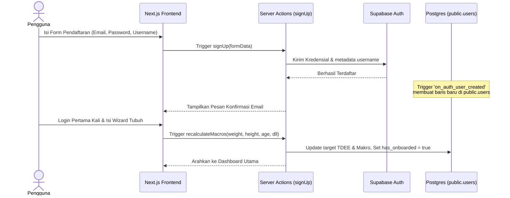
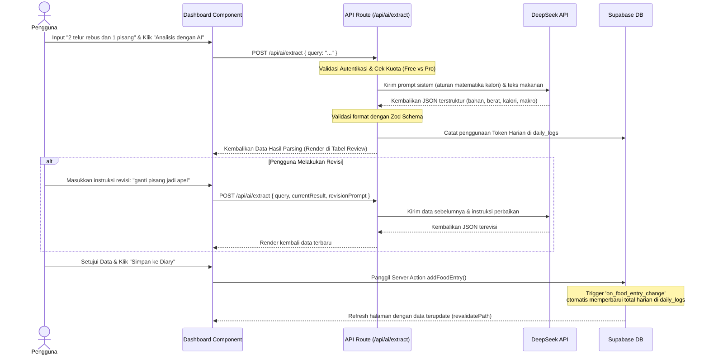

# Cetak Biru Arsitektur & Kerangka Kerja Lengkap: NutriFit

Dokumen ini berisi kerangka lengkap dari aplikasi web **NutriFit (Personal Nutrition Tracker)** dari hulu ke hilir. Cetak biru ini dirancang untuk memudahkan pemahaman struktur kode, alur data, integrasi kecerdasan buatan (AI), keamanan database, hingga langkah deployment.

---

## 1. Konsep & Arsitektur Umum

NutriFit adalah aplikasi pelacak nutrisi berbasis AI yang memungkinkan pengguna mencatat makanan secara cepat menggunakan bahasa sehari-hari (NLU - *Natural Language Understanding*). Aplikasi ini secara otomatis memecah kalimat makanan menjadi daftar bahan terstruktur beserta estimasi berat, kalori, dan makronutrisinya.

### Komponen Arsitektur Utama
- **Frontend & Routing**: [Next.js 16.2.7 (App Router)](https://nextjs.org/) dengan [React 19](https://react.dev/) untuk render hibrida (Server Components & Client Components).
- **Styling**: [Tailwind CSS v4](https://tailwindcss.com/) dengan dukungan Dark Mode dinamis berbasis `localStorage`.
- **Database & Auth**: [Supabase](https://supabase.com/) (PostgreSQL) dengan Row Level Security (RLS) untuk isolasi data pengguna serta pemicu (Database Triggers) untuk otomatisasi data.
- **AI Engine**: API DeepSeek (`deepseek-chat`) untuk parsing teks makanan secara terstruktur menggunakan format keluaran JSON (JSON Object).

---

## 2. Alur Kerja & Diagram Data

Berikut adalah diagram alur proses utama di dalam NutriFit:

### A. Alur Pendaftaran & Onboarding Pengguna


### B. Alur Logging Makanan dengan AI (DeepSeek NLU)


---

## 3. Skema Database (PostgreSQL / Supabase)

Database dirancang dengan integritas data yang ketat menggunakan relasi foreign key, validasi CHECK constraints, RLS policies, dan PostgreSQL Functions/Triggers.

### Tabel: `public.users`
Menyimpan profil pengguna yang terikat langsung dengan tabel autentikasi internal Supabase (`auth.users`).

| Kolom | Tipe Data | Aturan / Default | Deskripsi |
| :--- | :--- | :--- | :--- |
| `id` | `UUID` | `PRIMARY KEY REFERENCES auth.users(id)` | ID unik terikat dengan akun auth. |
| `role` | `TEXT` | `NOT NULL DEFAULT 'free' CHECK (role IN ('free', 'pro'))` | Tingkat keanggotaan pengguna. |
| `username` | `TEXT` | - | Nama profil pengguna. |
| `has_onboarded` | `BOOLEAN` | `NOT NULL DEFAULT FALSE` | Flag penanda setup target kalori pertama. |
| `daily_ai_requests` | `INT` | `NOT NULL DEFAULT 0` | Jumlah pemakaian request AI per hari ini. |
| `last_request_date` | `DATE` | `NOT NULL DEFAULT CURRENT_DATE` | Tanggal terakhir request AI (untuk reset limit). |
| `tdee_target` | `NUMERIC` | `NOT NULL DEFAULT 2000` | Target kalori harian (TDEE). |
| `protein_target` | `NUMERIC` | `NOT NULL DEFAULT 150` | Target protein harian (gram). |
| `carbs_target` | `NUMERIC` | `NOT NULL DEFAULT 200` | Target karbohidrat harian (gram). |
| `fat_target` | `NUMERIC` | `NOT NULL DEFAULT 65` | Target lemak harian (gram). |

### Tabel: `public.daily_logs`
Menyimpan rangkuman asupan kalori dan makronutrisi harian pengguna.

| Kolom | Tipe Data | Aturan / Default | Deskripsi |
| :--- | :--- | :--- | :--- |
| `id` | `UUID` | `PRIMARY KEY DEFAULT gen_random_uuid()` | ID unik log harian. |
| `user_id` | `UUID` | `NOT NULL REFERENCES public.users(id)` | Pemilik log harian. |
| `date` | `DATE` | `NOT NULL DEFAULT CURRENT_DATE` | Tanggal log. Unik per `user_id` + `date`. |
| `total_calories` | `NUMERIC` | `NOT NULL DEFAULT 0` | Total kalori masuk (dihitung otomatis). |
| `total_protein` | `NUMERIC` | `NOT NULL DEFAULT 0` | Total protein masuk (dihitung otomatis). |
| `total_carbs` | `NUMERIC` | `NOT NULL DEFAULT 0` | Total karbohidrat masuk (dihitung otomatis). |
| `total_fat` | `NUMERIC` | `NOT NULL DEFAULT 0` | Total lemak masuk (dihitung otomatis). |
| `tokens_used` | `INT` | `NOT NULL DEFAULT 0` | Total token LLM yang dikonsumsi hari ini. |

### Tabel: `public.food_entries`
Menyimpan rincian makanan yang dicatat oleh pengguna pada log harian tertentu.

| Kolom | Tipe Data | Aturan / Default | Deskripsi |
| :--- | :--- | :--- | :--- |
| `id` | `UUID` | `PRIMARY KEY DEFAULT gen_random_uuid()` | ID unik entri makanan. |
| `log_id` | `UUID` | `NOT NULL REFERENCES public.daily_logs(id) ON DELETE CASCADE` | Menghubungkan ke tabel `daily_logs`. |
| `raw_input` | `TEXT` | `NOT NULL` | Kalimat asli atau nama makanan. |
| `parsed_ingredients` | `JSONB` | `NOT NULL DEFAULT '[]'::jsonb` | Daftar bahan terperinci dari AI dalam format JSON. |
| `calories` | `NUMERIC` | `NOT NULL DEFAULT 0` | Total kalori entri ini. |
| `protein` | `NUMERIC` | `NOT NULL DEFAULT 0` | Total protein entri ini (gram). |
| `carbs` | `NUMERIC` | `NOT NULL DEFAULT 0` | Total karbohidrat entri ini (gram). |
| `fat` | `NUMERIC` | `NOT NULL DEFAULT 0` | Total lemak entri ini (gram). |

### Tabel: `public.saved_foods`
Basis data makanan pribadi yang disimpan oleh pengguna agar bisa dicari dan dimasukkan kembali dengan cepat menggunakan pengali porsi (*Portion Multiplier*).

| Kolom | Tipe Data | Aturan / Default | Deskripsi |
| :--- | :--- | :--- | :--- |
| `id` | `UUID` | `PRIMARY KEY DEFAULT gen_random_uuid()` | ID unik makanan tersimpan. |
| `user_id` | `UUID` | `NOT NULL REFERENCES public.users(id) ON DELETE CASCADE` | Pemilik data makanan. |
| `food_name` | `TEXT` | `NOT NULL` | Nama makanan. |
| `base_serving_description` | `TEXT` | `NOT NULL` | Deskripsi porsi dasar (misal: "1 porsi", "100g"). |
| `calories` | `NUMERIC` | `NOT NULL DEFAULT 0` | Kalori dasar. |
| `protein` | `NUMERIC` | `NOT NULL DEFAULT 0` | Protein dasar (gram). |
| `carbs` | `NUMERIC` | `NOT NULL DEFAULT 0` | Karbohidrat dasar (gram). |
| `fat` | `NOT NULL DEFAULT 0` | Lemak dasar (gram). |

---

## 4. Keamanan & Otomatisasi Database (RLS & Triggers)

### A. Row Level Security (RLS) Policies
Seluruh tabel diaktifkan RLS-nya agar pengguna hanya bisa membaca, mengubah, dan menghapus data milik mereka sendiri.
- **Tabel `users`**:
  ```sql
  CREATE POLICY "Users can view their own profile" ON public.users FOR SELECT USING (auth.uid() = id);
  CREATE POLICY "Users can update their own profile" ON public.users FOR UPDATE USING (auth.uid() = id);
  CREATE POLICY "Users can insert their own profile" ON public.users FOR INSERT WITH CHECK (auth.uid() = id);
  ```
- **Tabel `daily_logs`**:
  ```sql
  CREATE POLICY "Users can manage their own daily logs" ON public.daily_logs USING (auth.uid() = user_id) WITH CHECK (auth.uid() = user_id);
  ```
- **Tabel `food_entries`**:
  ```sql
  CREATE POLICY "Users can manage food entries of their own logs" ON public.food_entries 
  USING (EXISTS (SELECT 1 FROM public.daily_logs WHERE public.daily_logs.id = food_entries.log_id AND public.daily_logs.user_id = auth.uid()))
  WITH CHECK (EXISTS (SELECT 1 FROM public.daily_logs WHERE public.daily_logs.id = food_entries.log_id AND public.daily_logs.user_id = auth.uid()));
  ```
- **Tabel `saved_foods`**:
  ```sql
  CREATE POLICY "Users can manage their own saved foods" ON public.saved_foods USING (auth.uid() = user_id) WITH CHECK (auth.uid() = user_id);
  ```

### B. Otomatisasi Registrasi (Trigger `on_auth_user_created`)
Saat pengguna berhasil mendaftar melalui Supabase Auth, pemicu PostgreSQL akan otomatis membuat baris profil di tabel `public.users` dengan nilai target awal default:
```sql
CREATE OR REPLACE FUNCTION public.handle_new_user()
RETURNS TRIGGER AS $$
BEGIN
    INSERT INTO public.users (id, role, username, has_onboarded, daily_ai_requests, last_request_date, tdee_target, protein_target, carbs_target, fat_target)
    VALUES (new.id, 'free', COALESCE(new.raw_user_meta_data ->> 'username', 'User_' || substr(new.id::text, 1, 8)), FALSE, 0, CURRENT_DATE, 2000, 150, 200, 65);
    RETURN NEW;
END;
$$ LANGUAGE plpgsql SECURITY DEFINER;
```

### C. Otomatisasi Kalkulasi Total Log Harian (Trigger `on_food_entry_change`)
Setiap kali ada penambahan, pembaruan, atau penghapusan baris pada `food_entries`, database otomatis menghitung ulang jumlah total kalori, protein, karbohidrat, dan lemak pada log harian terkait:
```sql
CREATE OR REPLACE FUNCTION public.update_daily_log_totals()
RETURNS TRIGGER AS $$
DECLARE
    target_log_id UUID;
END;
...
```

---

## 5. Struktur Folder Proyek

Aplikasi ini dibangun menggunakan arsitektur modular Next.js (App Router) dengan TypeScript:

```
├── .env.example                # Template variabel lingkungan
├── next.config.ts              # Konfigurasi Next.js (TypeScript)
├── schema.sql                  # Skema database & script setup RLS/Triggers
├── package.json                # Dependensi proyek (Next.js, Tailwind v4, Supabase SSR, Zod)
├── src/
│   ├── middleware.ts           # Middleware global untuk proteksi rute halaman
│   ├── lib/
│   │   ├── schemas.ts          # Zod schema untuk validasi formulir & AI parser
│   │   └── supabase/
│   │       ├── client.ts       # Supabase Client SDK (Client-side)
│   │       ├── server.ts       # Supabase Server SDK (Server-side & Server Actions)
│   │       └── middleware.ts   # Handler sinkronisasi session Supabase di middleware
│   ├── components/
│   │   └── Dashboard.tsx       # Komponen utama visual dashboard & panel interaktif (92KB)
│   └── app/
│       ├── layout.tsx          # Wrapper layout utama HTML, font Geist, global CSS
│       ├── page.tsx            # Server Component pemuat data & render <Dashboard />
│       ├── globals.css         # Styling global & inisialisasi Tailwind v4
│       ├── actions.ts          # Server Actions (Auth, Target Kalkulasi, Entri Makanan)
│       ├── auth/
│       │   └── callback/
│       │       └── route.ts    # Callback handler OAuth & Verifikasi Email Supabase
│       ├── login/
│       │   └── page.tsx        # Halaman form masuk akun (Sign In)
│       ├── register/
│       │   └── page.tsx        # Halaman form pendaftaran akun baru (Sign Up)
│       └── api/
│           └── ai/
│               └── extract/
│                   └── route.ts # Endpoint pemanggilan AI DeepSeek NLU
```

---

## 6. Detail Fitur & Logika Bisnis

### A. Wizard Onboarding & Kalkulasi TDEE
Jika kolom `has_onboarded` pada tabel `users` bernilai `FALSE`, pengguna akan dipaksa melihat Wizard Onboarding. Target gizi harian dihitung menggunakan rumus **Mifflin-St Jeor**:
- **BMR (Basal Metabolic Rate)**:
  - Laki-laki: $10 \times \text{Berat (kg)} + 6.25 \times \text{Tinggi (cm)} - 5 \times \text{Umur (tahun)} + 5$
  - Perempuan: $10 \times \text{Berat (kg)} + 6.25 \times \text{Tinggi (cm)} - 5 \times \text{Umur (tahun)} - 161$
- **TDEE (Total Daily Energy Expenditure)**: $\text{BMR} \times \text{Faktor Aktivitas}$ (1.2 s.d 1.9).
- **Penyesuaian Target Kalori Berdasarkan Goals**:
  - `lose` (Menurunkan BB): Target Kalori = $\max(1200, \text{TDEE} - 500)$
  - `gain` (Meningkatkan Massa Otot): Target Kalori = $\text{TDEE} + 300$
  - `maintain` (Menjaga BB): Target Kalori = $\text{TDEE}$
- **Target Makronutrisi**:
  - **Protein**: 2.0g per kg berat badan (untuk target `lose` & `gain`), 1.8g per kg berat badan (untuk target `maintain`).
  - **Lemak**: 25% dari total kalori ($\text{Gram Lemak} = (\text{Target Kalori} \times 0.25) / 9$).
  - **Karbohidrat**: Sisa kalori yang tersedia ($\text{Gram Karbohidrat} = \max(50, (\text{Target Kalori} - \text{Kalori Protein} - \text{Kalori Lemak}) / 4)$).

### B. Fitur Pencatatan Makanan dengan AI (DeepSeek NLU)
Fungsi ini bekerja melalui endpoint server `/api/ai/extract`. Alur kerja backend-nya meliputi:
1. **Pengecekan Tier**:
   - **Free**: Limit 1 kali request per hari. Menggunakan kunci API global dari file `.env` (`DEEPSEEK_API_KEY_FALLBACK`).
   - **Pro (BYOK - Bring Your Own Key)**: Kuota tidak terbatas. Kunci API dibaca secara aman dari header request (`x-api-key`) yang dikirim dari `localStorage` browser pengguna.
2. **Rekayasa Prompt (Prompt Engineering)**:
   - Instruksi sistem memaksa AI menghasilkan daftar bahan makanan terperinci beserta takaran berat (gram) dan gizinya.
   - **Aturan Matematika Makro**: Kalori total bahan harus sama persis dengan rumus: $\text{Protein} \times 4 + \text{Karbohidrat} \times 4 + \text{Lemak} \times 9$. Jika ada selisih, AI diinstruksikan untuk melakukan penyesuaian agar hasilnya konsisten.
   - Hasil penjelasan pikiran analisis (`analysis_thoughts`) disajikan dalam Bahasa Indonesia yang ramah.
3. **Validasi & Penanganan Kesalahan**:
   - Respon JSON dari AI divalidasi ketat menggunakan pustaka **Zod** (`aiExtractionResponseSchema`).
   - Jika validasi gagal, API mengembalikan kode error 500 agar UI tidak mengalami malfungsi/crash.
   - Penggunaan token asli dari DeepSeek disimpan ke log harian (`tokens_used`) sebagai metrik pelacakan statistik.

### C. UI Dashboard Interaktif ([Dashboard.tsx](file:///Users/Farhan/Documents/AI/Nutrition%20Tracker/src/components/Dashboard.tsx))
Merupakan jantung interaksi pengguna dengan tampilan premium:
- **Tema Gelap/Terang**: Menggunakan sistem Tailwind 4 dengan transisi halus. Mode malam diaktifkan melalui manipulasi kelas `dark` pada elemen dokumen utama.
- **Hero Dashboard Section**: Visualisasi spanduk (banner) gradien premium di bagian atas halaman yang menggabungkan salam selamat datang dipersonalisasi, motivasi kebugaran cerdas berbasis pencapaian target, *slider* pencapaian kalori harian yang interaktif, serta baris metrik makronutrisi harian (Protein, Karbohidrat, Lemak).
- **AI Log Parser Panel**:
  - Tabel bahan makanan dinamis yang memungkinkan edit manual langsung secara inline (menambah bahan baru, menghapus baris, atau mengubah nilai angka).
  - Kotak revisi instan (*AI Revision Box*): Pengguna dapat mengetik perintah bebas ("ganti susu jadi low-fat", "ubah takaran ayam jadi setengah porsi") dan asisten AI akan mengolah ulang data tersebut dari context sebelumnya.
- **Autocomplete Pencarian Makanan**:
  - Kolom pencarian yang terintegrasi dengan database `saved_foods` pribadi pengguna.
  - Opsi *Portion Multiplier* (misal: memasukkan makanan tersimpan sebanyak $1.5\times$ porsi dasar).
- **Log Harian Interaktif**: Menampilkan seluruh makanan terdaftar pada hari tersebut dengan kemampuan menghapus log instan menggunakan tombol hapus.

### D. Rekap Nutrisi Mingguan (Weekly Nutrition Recap)
Sistem pelacakan tren nutrisi 7 hari terakhir yang terintegrasi di kolom kanan dashboard:
- **Kalkulasi Rata-rata**: Menyajikan data rata-rata kalori masuk harian dan frekuensi pencatatan makanan aktif pengguna selama satu minggu terakhir.
- **Grafik Batang Interaktif**:
  - Batang grafik digambar secara proporsional menggunakan CSS Tailwind murni (tanpa dependensi pustaka grafik luar) untuk memastikan performa yang cepat.
  - Batang hari yang sedang aktif disorot dengan warna kontras dan *ring outline*.
  - Garis bantu putus-putus (*dashed line*) horizontal berwarna merah sebagai referensi target batas kalori harian pengguna.
  - Interaksi navigasi: Pengguna dapat mengklik salah satu hari pada grafik mingguan untuk secara dinamis berpindah tanggal pencatatan diary (`/?date=YYYY-MM-DD`).
- **Tooltip Mengambang**: Mengarahkan kursor pada grafik akan memunculkan *tooltip* detail tanggal, total kalori harian, serta rincian makronutrisi (P, K, L) pada hari tersebut.
- **Rata-rata Makronutrisi**: Rincian rata-rata asupan protein, karbohidrat, dan lemak mingguan disajikan dalam bentuk panel kartu berwarna bertema.


---

## 7. Skema Validasi Zod ([schemas.ts](file:///Users/Farhan/Documents/AI/Nutrition%20Tracker/src/lib/schemas.ts))

Pengecekan integritas data di level server-action dan API route:

```typescript
import { z } from 'zod'

// Form hitung ulang makro
export const recalculateMacrosSchema = z.object({
  gender: z.enum(['male', 'female']),
  weight: z.coerce.number().min(30).max(300),
  height: z.coerce.number().min(100).max(250),
  age: z.coerce.number().min(10).max(120),
  activityLevel: z.coerce.number().min(1.2).max(2.5),
  goal: z.enum(['lose', 'maintain', 'gain']).default('maintain')
})

// Struktur bahan makanan keluaran AI
export const ingredientSchema = z.object({
  ingredient_name: z.string(),
  estimated_grams: z.number().min(0),
  calories: z.number().min(0),
  protein: z.number().min(0),
  carbs: z.number().min(0),
  fat: z.number().min(0),
})

// Struktur response AI lengkap
export const aiExtractionResponseSchema = z.object({
  food_name: z.string(),
  parsed_ingredients: z.array(ingredientSchema),
  total_calories: z.number().min(0),
  total_protein: z.number().min(0),
  total_carbs: z.number().min(0),
  total_fat: z.number().min(0),
  analysis_thoughts: z.string().optional(),
  sources: z.array(z.string()).optional()
})
```

---

## 8. Panduan Pengoperasian & Deployment

### Langkah 1: Pengaturan Variabel Lingkungan (`.env`)
Salin berkas `.env.example` menjadi `.env` di direktori utama proyek dan lengkapi nilai variabelnya:
```env
NEXT_PUBLIC_SUPABASE_URL=https://your-project-id.supabase.co
NEXT_PUBLIC_SUPABASE_ANON_KEY=eyJhbGciOiJIUzI1NiIsInR5cCI6IkpXVCJ9...
DEEPSEEK_API_KEY_FALLBACK=sk-your-global-deepseek-api-key
```

### Langkah 2: Migrasi Database Supabase
Jalankan isi dari berkas [schema.sql](file:///Users/Farhan/Documents/AI/Nutrition%20Tracker/schema.sql) di dalam menu **SQL Editor** pada Dashboard proyek Supabase Anda. Langkah ini akan membuat seluruh tabel, mengaktifkan RLS, mendaftarkan policies, serta mengonfigurasi triggers.

### Langkah 3: Menjalankan Server Pengembangan Lokal
Pasang seluruh dependensi terlebih dahulu, lalu jalankan server Next.js lokal:
```bash
npm install
npm run dev
```
Buka peramban di alamat `http://localhost:3000`.

### Langkah 4: Deployment ke Server Produksi (Vercel)
1. Hubungkan repositori Git Anda ke akun [Vercel](https://vercel.com).
2. Daftarkan variabel lingkungan (`NEXT_PUBLIC_SUPABASE_URL`, `NEXT_PUBLIC_SUPABASE_ANON_KEY`, dan `DEEPSEEK_API_KEY_FALLBACK`) pada panel pengaturan Environment Variables proyek Vercel Anda.
3. Jalankan proses deploy. Konfigurasi Next.js App Router akan otomatis mendeteksi Server Actions dan merutekan optimasi kompilasi.

---
*Dokumen ini dibuat secara otomatis sebagai cetak biru resmi untuk repositori Nutrition Tracker (NutriFit).*
